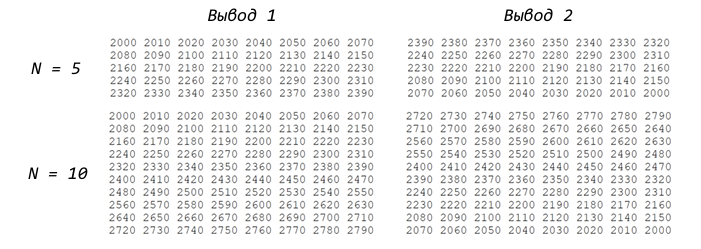

# Последовательные одноименные контейнеры

## Цели и задачи:
 Изучение алгоритмов формирования и обработки одномерных массивов и последовательных контейнеров, программирование и отладка программ формирования и обработки массивов.

## Методика выполнения:
1. Разработать алгоритм решения задачи по индивидуальному заданию.
2. Написать и отладить программу решения задачи.
3. Протестировать работу программы на различных исходных данных.

### Задание 1
#### Вариант 3

* 1. Пусть дано нелинейное уравнение 𝑓(𝑥) = 0, где 𝑓(𝑥) – функция, определена и непрерывна на некотором промежутке [a,b]. Требуется найти корни уравнения, числа х1, х2 и т.д. которые называются нулями функции. Решения осуществляется в два этапа: 
I. Находятся отрезки [ai,bi], внутри которых содержится один простой или кратный корень. Этот этап называется процедурой отделения корней. 
II. Уточняется до заданной точности одним из численных методов, в которых реализуются последовательные приближения. 
Практически все приближенные методы нахождения корней уравнений относятся к классу итерационных методов. 
Методом итерации назовем численный метод, который последовательно, шаг за шагом, уточняет первоначальное, грубое значение корня. Каждый шаг в методе называется итерацией. Важным свойством итерационных методов является сходимость метода. 

### Задание 2

#### Вариант 4

1. Напишите программу, в которой определен массив из 𝑛 чисел (𝑛 ≥ 10) и инициализирован случайными числами из диапазона [10, 100]. 
2. Найдите два наименьших элемента массива и вычислите сумму остатков получаемых от деления элементов массива из пункта 1 на минимальный элемент. 
3. Определите массив. Найдите самую длинную возрастающую последовательность чисел в массиве. Определите и инициализируйте новый массив найденной последовательностью.  
4. Вывести на экран массив длиной 𝑁 ×8 таким образом, как указано на рисунках. Первый элемент массива равен 2000. Необходимо выводить элементы строками по 8 элементов. 

### Задание 3
#### Xorshift 

* Генераторы случайных чисел Xorshift, также называемые генераторами сдвигового регистра, представляют собой подмножество регистров сдвига с линейной обратной связью (LFSR), которые обеспечивают особенно эффективную реализацию в программном обеспечении без чрезмерного использования разреженных полиномов. Они генерируют следующее число в своей последовательности, многократно принимая исключающее или числа с битовой версией самого себя. 

### Задание 4

#### Метод Борда 

Каждому кандидату начисляются баллы в зависимости от позиции в списке каждого избирателя. Например, если всего n кандидатов, то кандидат, стоящий на первом месте, получает (n – 1) баллов, на втором – (n – 2) и так далее до 0 баллов за последнее место. Побеждает кандидат, набравший суммарно наибольшее количество баллов. 

### Задание 5

#### Дилема заключенного

Требуется реализовать игру «Предать или сотрудничать» и реализовать 3 алгоритма поведения в игре. Игра состоит из случайного кол-ва раундов от 100 до 200 (итоговое кол-во раундов при каждом запуске игры генерируется случайно). На протяжении игровой сессии сражаются 2 алгоритма. В каждом раунде каждый алгоритм выбирает, либо сотрудничество, либо предательство. Если алгоритм А выбирает предательство и алгоритм Б выбирает предательство они получают по 4 очка. Если алгоритм А выбирает сотрудничество, а алгоритм Б выбирает предательство - алгоритм А получает 0 очков, а алгоритм Б получает 20 очков. Если оба алгоритма выбирают сотрудничество оба получают 24 очка. Каждому алгоритму в каждом раунде известны результаты всех предыдуще раундов текущей игровой сессии, на основе этих данных алгоритм может выбирать будет он сотрудничать или предаст. 

* Каждый алгоритм должен представлять из себя функцию с сигнатурой: boolean func(int32 round_number, array[boolean] self_choices, array[boolean] enemy_choices) round_number – номер текущего раунда self_choices – массив булевых значений, содержит информацию о собственных выборов (предать или сотрудничать) за все предыдущие раунды enemy_choices - массив булевых значений, содержит информацию о выборов (предать или сотрудничать) противника за все предыдущие раунд:  
true – сотруднничество 
false – предательство 